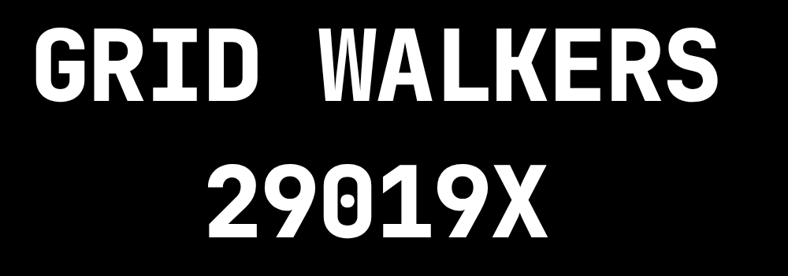

<div align="center">


<br/>


<h1>Grid Walkers – VEX Robotics Codebase</h1>

<p>
  <a href="https://gridwalkers.net" target="_blank"><b>gridwalkers.net</b></a>
  ·
  <a href="#getting-started"><b>Getting Started</b></a>
  ·
  <a href="#controls"><b>Controls</b></a>
  ·
  <a href="#autonomous"><b>Autonomous</b></a>
  ·
  <a href="#development"><b>Development</b></a>
</p>

</div>

---

> `High-performance VEX V5 code built with PROS and EZ-Template — dark, fast, reliable.`


## Highlights
- **Dark aesthetic:** Black/white with amber accents to match the site.
- **EZ-Template 3.x:** Chassis, odometry-ready tracking wheels, PID tuner, and an LLEMU auton selector.
- **Organized project:** `src/`, `include/`, and `firmware/` split for clarity.
- **Competition-ready:** Hold/coast brake modes, intake/shooter controls, and quick auton switching.


## Getting Started
- **Requirements**
  - PROS CLI
  - VEX V5 Brain + Controller
  - EZ-Template (included in repo as a zip; project already configured)

- **Build & Upload**
  ```bash
  pros build
  pros upload
  ```

- **Run**
  - Power on the brain.
  - Choose an autonomous from the LLEMU selector.
  - Switch to Driver Control to use teleop.


## Project Structure
```
new robo, new code/
├── src/
│   └── main.cpp             # Competition template + opcontrol
├── include/                 # Headers and subsystem declarations
├── firmware/                # Device configs / extras
├── EZ-Template@3.2.2.zip    # EZ-Template distribution (for reference)
├── project.pros             # PROS project file
└── README.md
```


## Controls
- **Drive:** Split arcade via `ez::SPLIT`.
- **Intake:** `R1` forward, `R2` reverse.
- **Index/Exit:** `B` forward, `DOWN` reverse.
- **Pneumatics:**
  - `L1` toggles `scraper`.
  - `L2` toggles `switcher`.
  - `RIGHT` toggles `hood`.

Adjust mappings in `src/main.cpp` if needed.


## Autonomous
- LLEMU selector is initialized in `initialize()`:
  ```cpp
  ez::as::auton_selector.autons_add({
    {"Red Right\n\n help", RedRight},
    {"Blue Right\n\n help", RedRight},
    {"Red Left\n\n help", RedLeft},
    {"Blue Left\n\n help", RedLeft},
    {"Nothing\n\n do nothing", nothing},
    {"Elite Red Left\n\n help", eliteREDLEFT}
  });
  ```
- Tune drive constants in your auton source files (`autons.*`) via `default_constants()`.
- Use the PID tuner in opcontrol: press `X` (when not on a comp switch).


## Development
- **Style:** Keep the dark theme in screenshots and diagrams. Prefer black canvas with white/amber accents (`#000`, `#fff`, `#FACC15`).
- **Commits:** Clear, small changes. Link to match videos when useful.
- **Branches:** `main` for stable; use feature branches for new mechanisms, autos, or tuning.


## Assets
- Place images in `assets/` and use relative links in Markdown.
  - `assets/logo-robot.png`      ← robot mark (used in header)
  - `assets/logo-wordmark.png`   ← team name/number wordmark (used in header)
  - `assets/robot-hero.png`      ← optional hero shot or render of the robot

> After moving files, GitHub will render the logo and preview automatically.


## Credits
- Built with **PROS** and **EZ-Template**.
- Grid Walkers Robotics — see more at **gridwalkers.net**.
